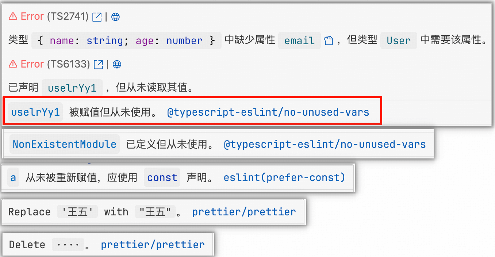
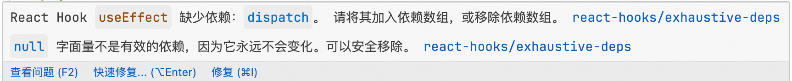

# ESLint 规则中文提示插件，且美化展示效果

## 隐藏原始 eslint 报错功能已实现，待补充到文档中。

## react hook 缺少多个依赖时会统计依赖的数量

## Features

- 支持 eslint 官方规则
- 支持 typescript-eslint 规则
- 支持 eslint-plugin-react 规则
- 支持 eslint-plugin-react-hooks 规则
- 支持 eslint-plugin-react-refresh 规则
- 支持 eslint-plugin-prettier 规则
- 支持 eslint-vue-plugin 规则

## Requirements

- ESLint
