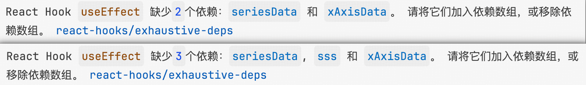

# ESLint 规则中文提示插件，且美化展示效果

若有翻译不完备的情况，可以评论区留言，给出示例代码及对应的展示截图，我会第一时间修复。

## 隐藏原始 eslint 报错。

1. 安装 [Custom CSS and JS Loader](https://marketplace.visualstudio.com/items?itemName=be5invis.vscode-custom-css) 插件

2. 按照插件提供的安装说明进行操作，并使用 [此 CSS 文件](./assets/style-hack.css)。

3. 文本中的代码颜色及代码背景色，可在上述 css 文件中根据自身喜好自行配置，注释完善，一看就懂。效果如下

## react hook 缺少多个依赖时会统计依赖的数量

## Features

- 支持 eslint 官方规则
- 支持 typescript-eslint 规则
- 支持 eslint-plugin-react 规则
- 支持 eslint-plugin-react-hooks 规则
- 支持 eslint-plugin-react-refresh 规则
- 支持 eslint-plugin-prettier 规则
- 支持 eslint-vue-plugin 规则

## Requirements

- ESLint
